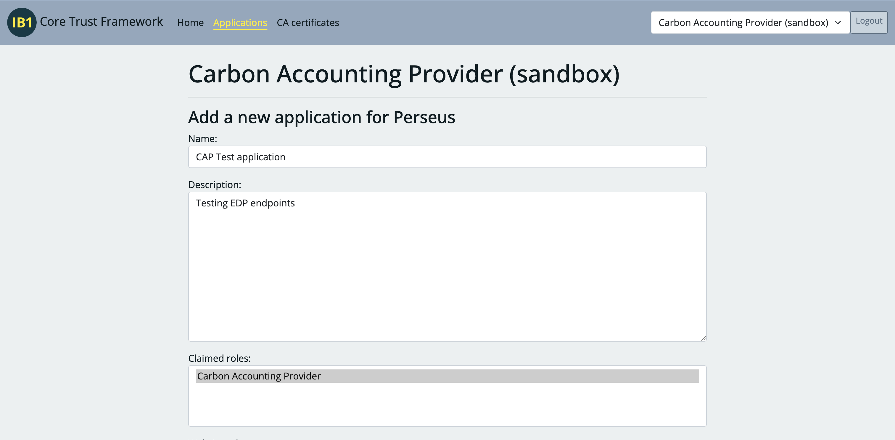
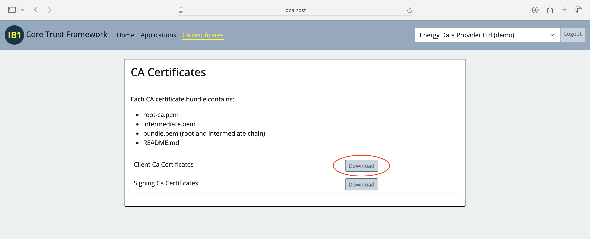

# Generate a testing key and certificate

## Create an application and certificate in the sandbox

*nb. If your organisation is an EDP you will have access to a test carbon accounting provider (CAP). Ensure you have selected this test organisation before proceeding with the steps below.*

1. Create an application with Carbon Accounting Provider as a claimed role


2. Click "New client certificate" and copy the csr command


3. Run the commands locally, creating a key and csr. Paste the csr into the text box 

4. Download the generated certificate, taking note of your application's URI


5. Download the client CA certificates


## Prepare certificate files

The cli requires two files, the key created above and a bundle of the intermediate client CA certificate and the generated certificate for the application. 

Create the bundle:

```bash
cat j4l5deko-client-cert.pem intermediate.pem > j4l5deko-client-bundle.pem
```

Move the two files to a folder accessible to the application. By default the application uses `certs/cap-demo-certs`.
