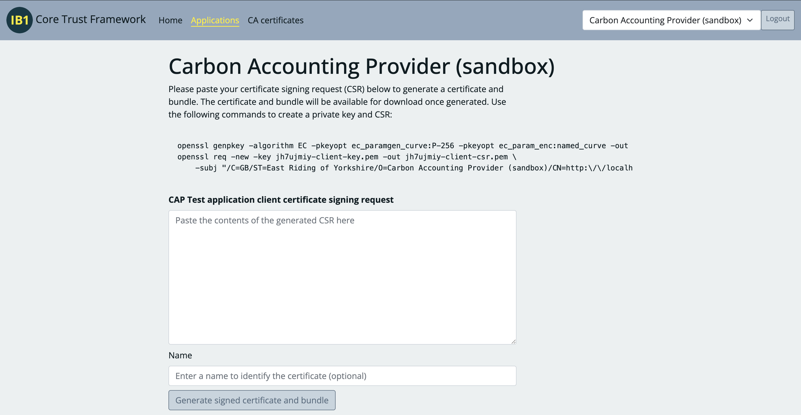
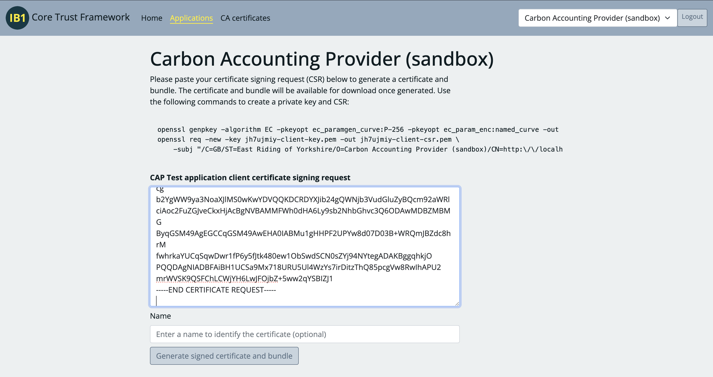
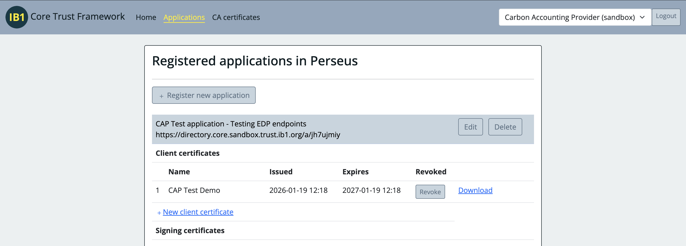

# Testing an EDP using the Cap Demo cli

## Generate a testing key and certificate

### Create an application and certificate in the sandbox

If your organisation is an EDP you will have access to a test carbon accounting provider (CAP). Ensure you have selected this test organisation before proceeding with the steps below. 

1. Create an application with Carbon Accounting Provider as a claimed role


2. Click "New client certificate" and copy the csr command


3. Run the commands locally, creating a key and csr. Paste the csr into the text box 

4. Download the generated certificate, taking note of your application's URI


5. Download the client CA certificates


### Prepare certificate files

The cli requires two files, the key created above and a bundle of the intermediate client CA certificate and the generated certificate for the application. 

Create the bundle:

```bash
cat j4l5deko-client-cert.pem intermediate.pem > j4l5deko-client-bundle.pem
```

Move the two files to a folder accessible to the application. By default the application uses `certs/cap-demo-certs`.

## Set environment variables

Set the following environment variables with appropriate values in a .env file in the cli/ folder:

```bash
# .env
CLI_MTLS_BUNDLE_PATH=../certs/cli-test/j4l5deko-client-bundle.pem # custom certificate path
CLI_MTLS_KEY_PATH=../certs/cli-test/j4l5deko-client-key.pem # custom key path

# Public server URL for authentication
CLI_PUBLIC_SERVER=https://perseus-demo-authentication.ib1.org
# Your sandbox issued application ID
CLI_CLIENT_ID=https://directory.core.sandbox.trust.ib1.org/a/j4l5deko
# Your protected data endpoint
CLI_PROTECTED_RESOURCE_URL=https://perseus-demo-energy.ib1.org # 
```

Optional settings:

```bash
CLI_SKIP_SERVER_VERIFICATION=false # Testing only, for servers running with self-signed certs
CLI_SERVER_CA_PATH=../certs/cap-demo-certs/cap-demo-key.pem # Only required if CLI_SKIP_SERVER_VERIFICATION is enabled
```

## Running the cli

The cli uses two scripts, get_code which generates an authorisation url, and callback_server which receives the authorisation code, exchanges it for a token, uses the token to retrieve data from the protected endpoint, and finally requests the permission record from the authentication server.

Start by running the callback server:

```bash
npm run start
```

The output will confirm configuration information:

```bash
MTLS key path: ../certs/cli-test/jh7ujmiy-client-key.pem
MTLS bundle path: ../certs/cli-test/jh7ujmiy-client-bundle.pem
Server CA bundle path: undefined
Skip server verification: false
APP_ENV environment variable is missing; defaulting to "local"
Successfully loaded certificates from local files
[mTLS] Client certificate CN: https://directory.core.sandbox.trust.ib1.org/m/4tnapijm
[mTLS] Bundle contains 2 certificate(s)
--------------------------------
🚀 Callback server running on http://localhost:3000
Waiting for authorization callback...
```

In another terminal screen, run `npm run get_code` to generate an authorisation URL using the configured `CLI_PUBLIC_SERVER`:

```
...
--------------------------------
Loading https://perseus-demo-authentication.ib1.org/.well-known/oauth-authorization-server
✅ Discovery successful
✅ Code verifier written to code_verifier.txt
Sending PAR request to https://mtls.perseus-demo-authentication.ib1.org/api/v1/par
[mTLS] Making request to: https://mtls.perseus-demo-authentication.ib1.org/api/v1/par
✅ PAR Response received with request_uri: urn:ietf:params:oauth:request_uri:3UTfZdDialMBmTXn_jxr6fcBKnU
--------------------------------
🔗 Open this URL to authorize:
https://perseus-demo-authentication.ib1.org/api/v1/authorize?client_id=https%3A%2F%2Fdirectory.core.sandbox.trust.ib1.org%2Fa%2Fjh7ujmiy&request_uri=urn%3Aietf%3Aparams%3Aoauth%3Arequest_uri%3A3UTfZdDialMBmTXn_jxr6fcBKnU
```

Open the generated URL and complete authorisation and granting permissions. A successful authorisation will redirect to the callback server, which will exchange the authorisation code and request data from the configured `CLI_PROTECTED_RESOURCE_URL`. The response will be displayed in the browser, e.g.

```json
{
"data":[
    {
        "type":"Electricity",
        "from":"2012-02-20T13:00:00Z",
        "to":"2012-02-20T13:30:00Z",
        "takenAt":"2012-02-20T13:15:00Z",
        "energy":{
            "value":976,
            "unitCode":"WHR",
        },
        "cumulative":{
            "value":976,
            "unitCode":"WHR",
        }
    },
...
```

The callback server terminal screen will display useful information about the request, including debugging information in case of failure.

```bash
# example output on success
Waiting for authorization callback...
--------------------------------
✅ Authorization code received
✅ Discovery successful
🔄 Exchanging authorization code for access token
Token endpoint: https://mtls.perseus-demo-authentication.ib1.org/api/v1/authorize/token
[mTLS] Making request to: https://mtls.perseus-demo-authentication.ib1.org/api/v1/authorize/token
✅ Access token received
Meter catalog URL: https://mtls.perseus-demo-energy.ib1.org//datasources/
[mTLS] Making request to: https://mtls.perseus-demo-energy.ib1.org/datasources/
✅ Meter catalog received
📈 Fetching data for meter S018011012261305588165 (import)
[mTLS] Making request to: https://mtls.perseus-demo-energy.ib1.org/datasources/S018011012261305588165/import?from=2024-12-05&to=2024-12-06
✅ Meter data received
🔍 Testing permissions with refresh token
Requesting permissions from: https://mtls.perseus-demo-authentication.ib1.org/
[mTLS] Making request to: https://mtls.perseus-demo-authentication.ib1.org/api/v1/permissions
✅ Permissions verified
--------------------------------
✅ All steps completed successfully
```

## Certificate debugging tool

Run `npx tsx verify_certs.ts` to check for any errors in your configured certificate files 
